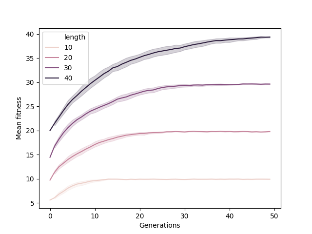

# Understanding parameters settings in Evolutionary Algorithms

## Objectives

* Introduce *inspyred*

* Understand the parameter settings of a basic GA

* Observe the basic behaviour of an EA

* Customize the parameter settings

* Gather and process the statistics

## Preliminary steps

First of all, if you are using Windows, you will need to install Python 3.X. Just [download it](https://www.python.org/downloads/) and install it as any other software. In case you where using Linux or Mac, you already has Python in your machine.

Install *inspyred* following the instructions available on http://pythonhosted.org/inspyred/. Basically, *inspyred* is a Python module that can be installed like any other module. From a Unix or PowerShell console, just type ```pip install inspyred```. You may need also install the package statistics, in that case execute the command ```pip install inspyred```.


## One-max problem with Inspyred

Download [this script](https://gist.github.com/dfbarrero/ea3f81cd9a7847147e48490dd0b44b50), which implements the one-max problem with a basic Genetic Algorithm implemented with inspyred. This problem is pretty simple, it requires the maximization of the number of ones in a binary chromosome. Once the Inspyred module is installed, you will need to open a shell and, from the same folder than the script is stored, run the script:

```
python onemax-ga.py
```

If everything works, the script must be printing stuff about the evolutionary process in the screen. You can get all the information about the script parameters running:

```
python onemax-ga.py -h
```

For instance, if you want to run the algorithm with a population of 100 chromosomes, type 

```
python onemax-ga.py --population 100
```

To increase the number of generations run by the algorhtm just put it in the corresponding parameters.

```
python onemax-ga.py --population 100 --generations 50
```

## Initial questions

Answer the following questions:

1. Which is the default parameter setting?

2. Execute the script several times, did it always find the solution? Why?

3. Observe how average and best fitness evolve along the time. Explain their behavior.

4. Execute the algorithm with mutation and crossover probability set to 0. Do you observe any evolution?

5. Execute the algorithm with crossover probability set to 0 and mutation probability to 0.5. Do you observe any evolution?

6. Change the chromosome length to 500 and run the algorithm. Do you observe any difference? Explain it.

7. Which is the function implemented by the argument 'jobs'?

## Impact of the parameters setting 

The main objective of this assignment is to assess the impact of the parameter settings in the Genetic Algorithm dynamics. To this end, we will execute the algorithm controlling each parameter. Please, take into account that a GA has a stochastic nature, so each time you execute it you will usually obtain a different result, so proper experimentation requires running the algorithm several times in order to measure its variability.



Using the default parameter settings as a starting point, change the following parameter settings and plot (please checkout the figure given as example) the mean fitness against the generation number controlled by the values of the parameter under study as follows.

1. Set crossover probability to 0, 0.5, 0.75 and 1.

2. Set mutation probability to 0, 0.01, 0.025, 0.05 and 0.1.

3. Set population size to 10, 30, 50 and 100.

4. Set tournament size to 2, 3, 4 and 5.

5. Set elitism to 1, 2 and 3.

5. Set chromosome length to 10, 20, 30, 50 and 100.

The final goal is to obtain a collecion of figures like the one showed here, along with an interpretation of the results.

You may need to change the maximum number of generations (some configurations may need a longer time to converge), but this number *does not* affect the evolutionary process, it just sets when to stop it.

## Final remarks

Take into account that you can easely store the algorithm output for futher processing. Evolution statistics is printed in stdout, while additional information is printed in stderr, it means that you can store the run statistics with a simple output redirect:

```
python onemax-ga.py > output.csv
```

that command overwrites output.csv each time it is executed. You can also append data to that file with the command 

```
python onemax-ga.py >> output.csv
```

If you want to store both, statistics and messages, execute the script redirecting stderr and stout:

```
python onemax-ga.py > output.csv 2> messages.txt
```

If you are a pro user you can use `tee` to monitor the script output while redirecting it to a file:

```
python onemax-ga.py | tee output.csv 
```

Remember that CSV is a common file format to store structured data; you can process it with any data processing software such as Excel or SPSS.
