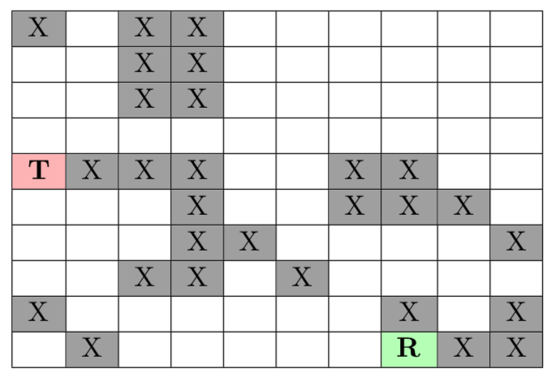

# Path-planning exercises

## Objectives

* Implement path-planning algorithms

* Increase knowledge about path-planning

## Preliminary step

As a first step, the student can get an idea of how Path Planning algorithms work using the following application:

http://qiao.github.io/PathFinding.js/visual/

## Implementation

We want to compare the Dijkstra Algorithm against A* with different heuristics (e.g. Octile, Manhattan, Euclidean and Chebyschev).
You can create your own implementation of both  integrated algorithms or you can reuse previous code. For example:

- Here you can find a Dijkstra implementation

https://gist.github.com/econchick/4666413

- And in this other link, an A* implementation

https://gist.github.com/jamiees2/5531924

(Be aware of the Python version used)

Perform the following tasks:

1. Get familiar with both algorithms running different scenarios with the Web application.

2. Consider the following grid map (10 X 10) where the robot is located at the cell labeled with R, and the target is located at the cell labeled with T. All the cells labeled with X are considered as occupied cells and the cells labeled with B are considered free to pass. Run the algorithms and see the results.  

 

3. Implement (or resuse) A* and Dijkstra algorithms.

4. Implement the following heuristics for A*: Octile, Manhattan, Euclidean and Chebyschev.

5. Run A* with the different heuristics.

6. Compare to Dijkstra.

7. What is the better algorithm and/or heuristic? Why?

