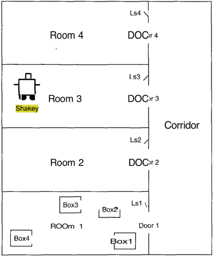

# PDDL v1 exercises

## Objectives

* Practice PDDL v1 syntax.

* Implement a PDDL domain and problem.

## Introduction

In order to help in the resolution of problems, one can check the International Planning Competitions (IPC) where the student can find to ns of domains. Some links are:

* [CSU Planning Repository: AIPS 2002 Planning Competition Problems and Domains](http://www.cs.colostate.edu/meps/repository/aips2002.html)

* [IPC 2011 domains](http://www.plg.inf.uc3m.es/ipc2011-deterministic/Domains)

## Exercise 1: Robot motion planning

The original STRIPS program was designed to control Shakey, a robot that roamed the halls of SRI in the early 1970s. It turns out that most of the work on STRIPS involved simulations where the actions performed were just printing to a terminal, but occasionally Shakey would actually move around, grab, and push things based on the plans created by STRIPS. The figure shows a version of Shakey’s world consisting of four  rooms lined up along a corridor, where each room has a door and a light switch.

Shakey can move from place to place, push movable objects (such as boxes), climb on and off of rigid objects (such as boxes) and turn light switches in and off. There are 6 actions:

* Go from current location x to location y: Go (x,y) moves from x to y (that cannot be the same room). By convection there is a room between rooms.
* Push an object b from location x to location y: Push(b,x,y).
* Climb up/down onto a box: Climb(b).
* Switch on/off  the  light. Because Shakey is short, this can only be done when Shakey is on top of a box that is at the room location.

Define the domain and the problem for the Shakey world and generate the problem of the figure. Extend the domain to include the actions Open and Close. As preconditions for the Go action, add that the door should be open. Assume that when pushing or switching the interruptor is enough that they are in the same place (don ́t consider cells since it would complicate the problem). Create a more complex problem with double/triple number of rooms and boxes randomly distributed.  It could be no corridors in the new problem.

## Exercise 2: Mars rover

Suppose we have a rover on Mars, and we want it to move from its initial position to a final situation. To simplify the problem we will only consider that the rover moves following the Cardinal points directions (North, South, East and West) and for the representation of the point, a Cartesian coordinate system. Extend the problem to consider more movements type: Northeast, Southwest, etc. Increment the number of coordinates up to x = 7, y = 7 (maximum). Add also obstacles. Suppose the problem of moving the rover from position (1,1) to (1,4). Does it work correctly? Briefly describe the problems that you find (if any).
