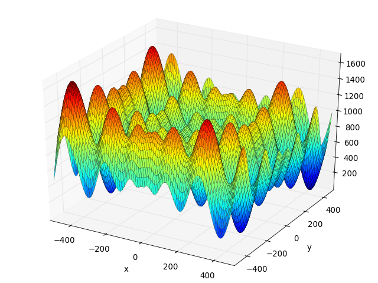

Real number optimization with Inspyred

## Objectives

* Introduce *inspyred*

* Understand the parameter settings of a basic GA

* Observe the basic behaviour of an EA

* Customize the parameter settings

* Gather and process the main statistics

## Preliminary steps

Install *inspyred* following the instructions available on http://pythonhosted.org/inspyred/. Basically, *inspyred* is a Python module that can be installed like any other module. From an Unix console, just type ```pip install inspyred```.


## Real number function optimization with Inspyred

This exercise deals with the optimization of a function. We will optimize the parameters of a function named the Schwefel function, that can be formally stated as follows:


where *n* represents the number of dimensions and x_i \in [-500, 500] for all i=1,...,n. The input values that optimizes the function is [420.9687, 420.9687, ..., 420.9687], this a minimization task and the best fitness is 0. A graphical representation of this problem for n=2 (two dimensions) follows.



The code that implemens a GA that solves the Schwefel problem is the next listing. You can download the (code here)[code/ga_example.py]. 

```Python
from random import Random
from time import time
import inspyred

# Do not touch this value
maxEvaluations=8000

# Customize these parameters
popSize = X
mutRate = X
elitism = X
tourSize = X
xoverPoints = X

def showStatistics(population, num_generations, num_evaluations, args):
    stats = inspyred.ec.analysis.fitness_statistics(population)
    print('Generation {0}, best fit {1}, avg. fit {2}'.format(
            num_generations, stats['best'], stats['mean']))

def main(prng=None, display=False):
    if prng is None:
        prng = Random()
        prng.seed(time())

    problem = inspyred.benchmarks.Binary(inspyred.benchmarks.Schwefel(2),
                                         dimension_bits=30)
    ea = inspyred.ec.GA(prng)
    ea.terminator = inspyred.ec.terminators.evaluation_termination
    ea.observer = showStatistics
    ea.selector = inspyred.ec.selectors.tournament_selection
    final_pop = ea.evolve(generator=problem.generator,
                          evaluator=problem.evaluator,
                          pop_size=popSize,
                          maximize=problem.maximize,
                          bounder=problem.bounder,
                          max_evaluations=maxEvaluations,
                          num_elites=elitism,
                          tournament_size=tourSize,
                          mutation_rate=mutRate,
                          num_crossover_points=xoverPoints)

    if display:
        best = max(final_pop)
        print('Best Solution: \n{0}'.format(str(best)))
    return ea

if __name__ == '__main__':
    main(display=True)
```

Please observe that the main algorithm parameters have been deleted. The remaining parameters are as follows:

* Representation: Binary

* Chromosome length: 30

* Crossover: n-point crossover

* Mutation: Flip mutation

* Mutation probability: X

* Population size: X

* Termination: 8,000 evaluations

Perform the following tasks:

1. Set the parameters to get a perfect solution (fitness=0).

2. Set the parameters to get the solution as soon as possible.

3. Execute the algorithm 10 times and show a graph relating generation, best fitness and average fitness. To obtain the graph values, average across all the 10 runs. If necessary, change the code and use any external tool (Excel, Matlab, R, Gnuplot, ...) at your convenience.

