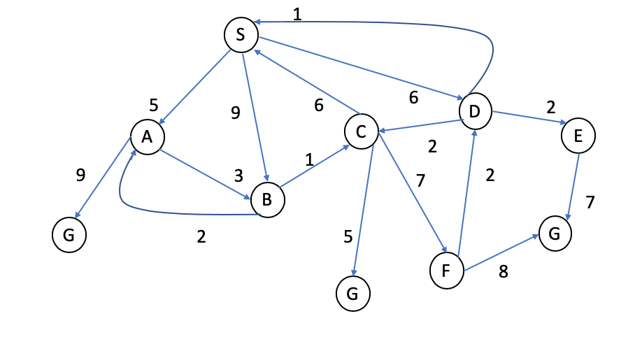

## Examples for practicing search algorithms

## Example 1
Given the following tree, expand it with minimum cost using the following algorithms: 
- Breadth-First Search 
- Depth-First Search
- Iterative Deepening Depth-First Search
- Greedy Search 
- A* Search

## Example 2
Given the following graph, expand it with minimum cost using the uniform cost algorithm. 'S' is the initial state and 'G' are the goal states. 

