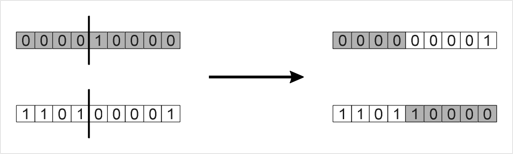

# One-max with Genetic Algorithm

Problem: Maximize the number of ones in a binary string (length $20$)

Fitness: Number of ones in the string

Selection: Take two random strings and select the fittest one

Mutation: Flip a random bit with probability 0.05

Crossover: One-point crossover

## Tasks

1. Show best fitness in each generation

2. Show average fitness in each generation

3. Show number of generations to get the solution

4. Change length to $40$ and repeat, what happens?

